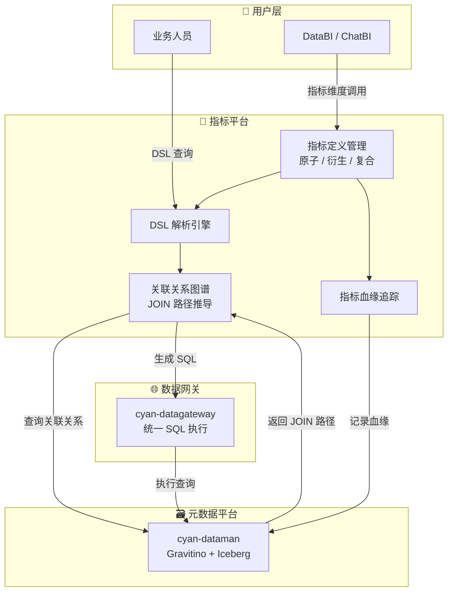

# cyan-datametric

<div align="center">

<!-- 标题 -->
<h1>🎯 cyan-datametric</h1>
<p><b>指标平台 — 数据应用服务的基石</b></p>

<!-- 徽章 -->


</div>

---

## 📌 项目简介

**cyan-datametric** 是 cyan 数据平台的**指标维度管理中心**，为上层数据应用（如 DataBI）提供标准化的指标定义、查询与分析能力。

核心定位：**让业务人员用 DSL 描述需求，平台自动完成复杂的跨表聚合计算。**

---

## 🏗️ 架构设计



---

## 📦 模块说明

```
cyan-datametric/
├── cyan-datametric-application/    # 应用层 — 核心服务入口
│   ├── adapter/                    # 适配层（Web / RPC / 事件）
│   ├── application/                # 应用服务层
│   ├── domain/                     # 领域层（指标、维度、DSL）
│   └── infra/                      # 基础设施层（仓储、外部调用）
└── cyan-datametric-client/         # SDK 层 — 供其他服务引用的 Feign 客户端
```

| 模块 | 职责 |
|------|------|
| `cyan-datametric-application` | 指标定义 CRUD、DSL 解析、图谱查询、血缘追踪 |
| `cyan-datametric-client` | 对外暴露的 Feign 接口，供 DataBI / DataGateway 调用 |

---

## 🛠️ 技术栈

| 类别 | 技术 |
|------|------|
| 基础框架 | Java 17、Spring Boot 3.3.13、Spring Cloud Alibaba |
| 数据访问 | MyBatis Plus 3.5.7、MySQL 8.3.0、Druid 连接池 |
| 服务治理 | Nacos（注册中心 + 配置中心） |
| 内部依赖 | cyan-arch（基础组件）、cyan-dataauth-client（权限校验）、cyan-employee-login（登录认证） |
| 工具类 | Lombok、MapStruct、Hutool |

---

## ✨ 核心功能

### 1. 指标维度定义
- **原子指标**：直接从数据源映射的基础度量（如 `订单金额`）
- **衍生指标**：基于原子指标通过公式计算（如 `日均订单金额 = 订单金额 / 天数`）
- **复合指标**：多指标组合计算（如 `客单价 = 订单金额 / 订单数`）
- 支持指标版本管理与历史回溯

### 2. DSL 查询语言
- 面向业务人员的**声明式查询 DSL**，屏蔽底层 SQL 复杂度
- 示例：
  ```
  SELECT 订单金额, 用户数
  FROM 订单表
  WHERE 日期 BETWEEN '2024-01-01' AND '2024-12-31'
  GROUP BY 月份
  ```
- DSL → SQL 转换由平台自动完成

### 3. 智能聚合（关联关系图谱）
- 基于 **cyan-dataman 元数据平台**的关联关系图谱
- 自动推导表之间的 JOIN 路径，实现**跨表指标聚合**
- 支持多跳关联（A → B → C）的复杂聚合场景

### 4. 指标血缘追踪
- 记录指标定义与数据源的依赖关系
- 上游表变更时自动识别受影响指标
- 提供血缘链路可视化能力

---

## 🚀 快速开始

### 环境要求
- JDK 17+
- Maven 3.8+
- MySQL 8.0+
- Nacos 2.3.0

### 1. 克隆项目
```bash
git clone https://github.com/cyan-daimao/cyan-datametric.git
cd cyan-datametric
```

### 2. 编译构建
```bash
mvn clean install -DskipTests
```

### 3. 初始化数据库
执行 `cyan-datametric-application/src/main/resources/sql/init.sql` 中的建表语句。

### 4. 配置 Nacos
在 Nacos 控制台创建配置 `cyan-datametric-application.yaml`：
```yaml
server:
  port: 8085

spring:
  datasource:
    url: jdbc:mysql://localhost:3306/cyan_datametric?useUnicode=true&characterEncoding=utf-8
    username: root
    password: your_password

  cloud:
    nacos:
      discovery:
        server-addr: 127.0.0.1:8848
      config:
        server-addr: 127.0.0.1:8848
```

### 5. 启动服务
```bash
cd cyan-datametric-application
mvn spring-boot:run
```

### 6. 验证接口
```bash
curl http://localhost:8085/actuator/health
```

### 7. 其他服务引用 client
```xml
<dependency>
    <groupId>com.cyan</groupId>
    <artifactId>cyan-datametric-client</artifactId>
    <version>1.0-SNAPSHOT</version>
</dependency>
```

---

## 🔗 关联项目

| 项目 | 关系 |
|------|------|
| [cyan-dataman](https://github.com/cyan-daimao/cyan-dataman) | 元数据平台 — 提供关联关系图谱 |
| [cyan-datagateway](https://github.com/cyan-daimao/cyan-datagateway) | 数据网关 — 执行生成的 SQL |
| [cyan-databi](https://github.com/cyan-daimao/cyan-databi) | 智能分析 — 调用指标平台创建图表 |
| [cyan-dataauth](https://github.com/cyan-daimao/cyan-dataauth) | 数据权限 — 指标查询的权限校验 |

---

<div align="center">

<p>Made with ❤️ by <a href="https://github.com/cyan-daimao">cyan-daimao</a></p>

</div>
